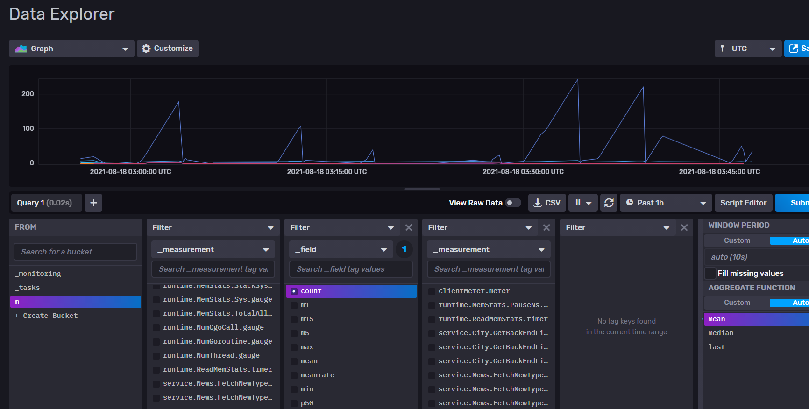

# rpcx-serverplugin-influxdb
rpcx serverplugin influxdb2 


## Usage 


```go
    import (
        "github.com/smallnest/rpcx/serverplugin"

	    influxdb2 "github.com/masterZSH/rpcx-serverplugin-influxdb"
    )

    // register metrics
    p := serverplugin.NewMetricsPlugin(metrics.DefaultRegistry)
	s.Plugins.Add(p)
	startMetrics()


    func startMetrics() {
	 metrics.RegisterRuntimeMemStats(metrics.DefaultRegistry)
	 go metrics.CaptureRuntimeMemStats(metrics.DefaultRegistry, time.Second)
	 go influxdb2.InfluxDB2(metrics.DefaultRegistry, 1e9, "http://127.0.0.1:8086", "m", "QSCQLBVf81wO0GJ7pJ6J5sU4rtHuyL19n9WDYmbpqKYQdEefI6goRu_xsHHiJckKXp2w-Vr47u8CdyW0TDd2ig==", "zsh")
    }
```



